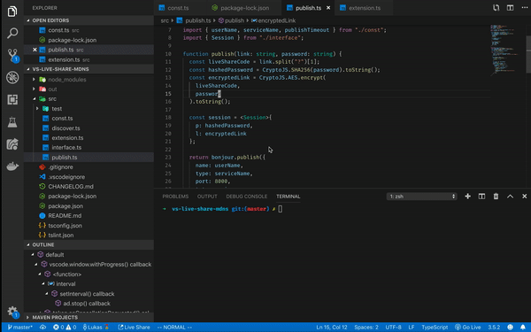
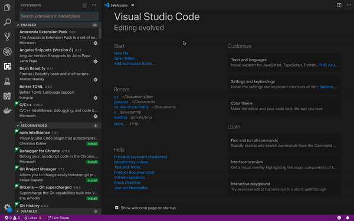
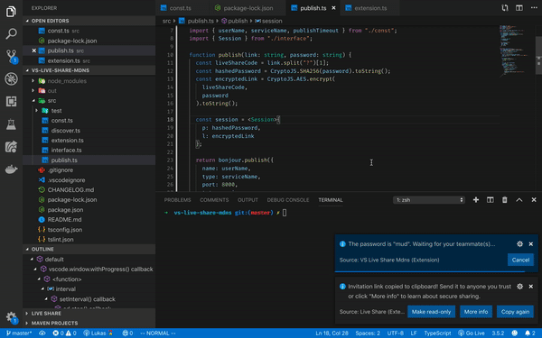

# vs-live-share-mdns

## Overview

`Live Share` is great! It's a tool to "enable your team to quickly collaborate on the same codebase without the need to synchronize code or to configure the same development tools, settings, or environment." 

But, have you ever had a problem when you just want to share your session's link to your friends/colleagues that are **right next to you**? Guess what? You'll end up doing,

  1. Turn on your live share session
  2. Copy the session's link
  3. Send the link to your friends/colleagues through email

This is the problem that this extension is trying to solve! You don't need to go out from VS Code anymore and focus on what matters!

## How to use?

### 1. [Host] Publish your session

Go to the [command palette](https://code.visualstudio.com/docs/getstarted/userinterface#_command-palette) (press ⇧⌘P). Then, find "`Live Share Mdns: Publish`" and share the session password with your friend!

### 2. [Teammate] Discover the session

Go to the [command palette](https://code.visualstudio.com/docs/getstarted/userinterface#_command-palette) (press ⇧⌘P). Then, find "`Live Share Mdns: Discover`". If the dialog says that you have discovered the host, you can cancel at anytime. Another dialog will show up to give you a list of hosts.

### 3. [Teammate] Enter the password and collaborate!

Get the password from the host. For example, in this demo, the password is "`mud`".

